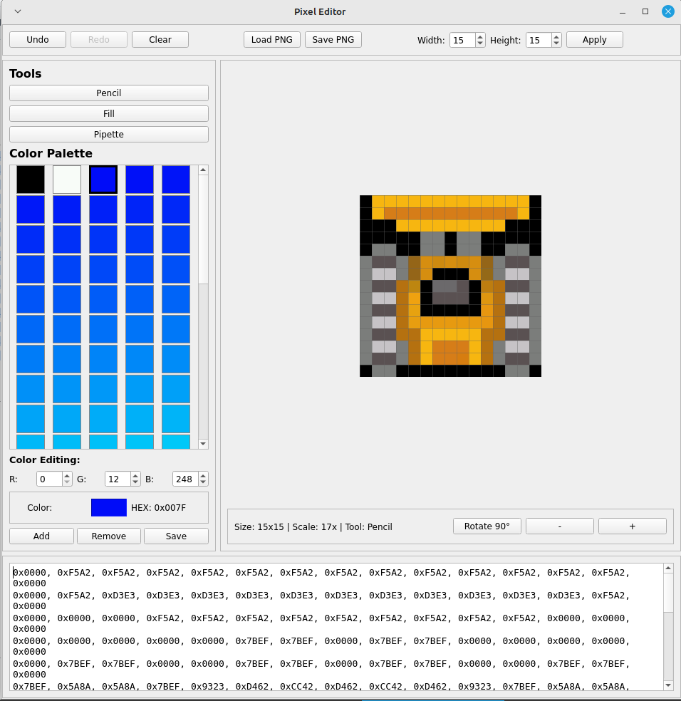

# Pixel Editor

A cross-platform pixel art editor with RGB565 color support, designed for embedded graphics and microcontroller projects. Supports multiple languages via UI selection.

## Features
- **Pixel-perfect canvas** with zoom (2x-20x), grid display, and smooth scaling
- **Tools**: Pencil, Flood Fill, Color Picker (pipette)
- **Color palette**: Custom RGB565 colors, add/remove colors, save/load palettes as JSON
- **History**: Undo/Redo (50 steps), canvas clear, resize, 90° rotation
- **Import/Export**: PNG images, hex array data (for C/embedded use)
- **Edit text data**: Edit hex data directly in the text area (format: `0x1234, 0xABCD`)

## Screenshots

Compact interface with tools, color picker, hex preview, and canvas controls.

## Quick Start
1. Install PyQt5: `pip install PyQt5`
2. Run: `python pixel_editor.py`
3. Select language if prompted, then start drawing!

## Usage
- Draw with pencil, fill areas, pick colors
- Edit hex data directly in the text area (format: `0x1234, 0xABCD`)
- Ctrl+Z/Y for undo/redo, +/- for zoom
- Save palette as `palette.json` for reuse

**Perfect for game sprites, icons, and embedded displays (Arduino/ESP32)!**
